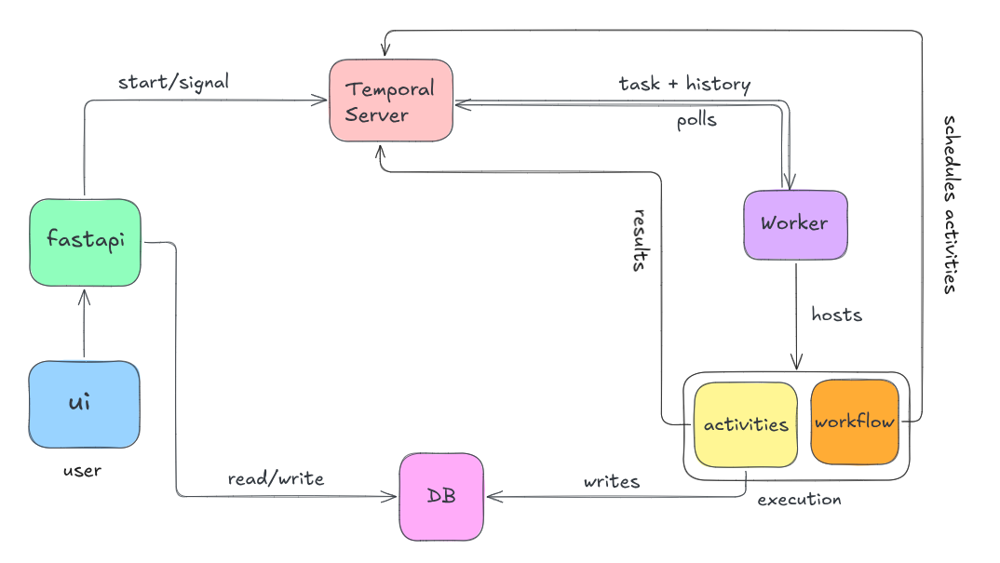

# Order Supervisor

AI-powered long-running order lifecycle supervisor using Temporal workflows.

**Flow:**

1. User creates a supervisor config (name, instruction, wake behavior)
2. User starts a run for an order → API creates DB record + starts Temporal workflow
3. Temporal workflow invokes the AI agent on: start, events, scheduled wake-ups
4. Agent uses tools (message teams, create notes) → stored as activity records
5. Agent sets sleep duration → workflow sleeps until next event or timeout
6. Terminal events or manual termination → agent generates final summary

## Setup

### Prerequisites

- Python 3.11+
- Node.js 18+
- Docker (for Temporal server)

### 1. Start Temporal (Terminal 1)

```bash
temporal server start-dev
```

Temporal UI available at http://localhost:8233

### 2. Start the API (Terminal 2)

```bash
uv sync
uv run uvicorn api.main:app --reload --port 8000
```

API available at http://localhost:8000

### 3. Start the Temporal Worker (Terminal 3)

```bash
uv run python -m temporal.worker
```

### 4. Start the UI (Terminal 4)

```bash
cd ui
yarn install
yarn dev
```

UI available at http://localhost:3000

## Usage

1. Go to **Supervisors** → **New Supervisor** → create with a name and instruction
2. Go to **Runs** → select supervisor, enter order ID → **Start Run**
3. On the run detail page:
   - **Send events** (payment_confirmed, shipment_delayed, etc.)
   - **Add instructions** (e.g. "Prioritize speed over cost")
   - **Pause/Resume/Terminate** the run
   - Watch the **Activity Log** update in real-time
4. Send a `delivered` event to trigger run completion with final summary

## CLI Tools

```bash
# Send event to a workflow
python -m temporal.trigger event order-run-<id> '{"type":"payment_failed","data":{}}'

# Query workflow state
python -m temporal.trigger query order-run-<id>

# Pause/resume/terminate
python -m temporal.trigger pause order-run-<id>
python -m temporal.trigger resume order-run-<id>
python -m temporal.trigger terminate order-run-<id>
```

## Architecture and Design Notes



1. **Three-tier stack**: Next.js UI (port 3000) → FastAPI backend (port 8000) → Temporal server (port 7233) with a separate Python worker process running the `OrderSupervisorWorkflow` + activities.
2. **One workflow per order**: Creating a run starts a long-running Temporal workflow (`order-run-<id>`) that lives until a terminal event (`delivered`), manual termination, or `set_status` signal.
3. **Three wake triggers**: `run_start` (initial invocation), `event` (signal-driven from `new_event` or `add_instruction`), and `scheduled_wakeup` (timeout-driven from agent-set `sleep_seconds`). Agent sleeps indefinitely when `sleep_seconds` is 0/None.
4. **Signal-based control plane**: `new_event`, `add_instruction`, `set_status` (pause/resume/terminate) — all flow API → Temporal client → workflow. No polling.
5. **Single activity log table**: All events, agent actions, wake/sleep decisions, reasoning, instructions, and summaries live in `activities` as typed JSON rows — simpler than separate tables and sufficient for UI timeline.
6. **Agent state = JSON dict in workflow memory + persisted to `runs.state`**: survives across wake cycles; workflow memory is authoritative during execution, DB is for UI display and crash recovery.
7. **System-owned completion**: agent cannot end the run itself — only terminal events (`delivered`), manual termination, or the generated final summary close the run.
8. **CAVEAT — LLM is fully mocked (to save costs)**: `temporal/activities.py` uses a hardcoded `EVENT_RESPONSES` dict keyed by event type; no Anthropic API calls, no real reasoning, no real tool-use loop. Anthropic SDK was removed from deps.
9. **CAVEAT — no real classifier**: every event wakes the agent; `wake_aggressiveness` on the supervisor config is stored but unused. A real impl would route events through a lightweight classifier (LLM or rules) before waking the main agent.
10. **Other POC shortcuts**: SQLite instead of Postgres, no auth, no retry policies on activities, no crash recovery for in-flight DB writes, UI polls every 3s instead of streaming, no max-run-age enforcement, no supervisor-template library (single custom config per supervisor).

## Project Structure

```
order-supervisor-ai/
├── README.md
├── architecture.png
│
├── backend/                        # Python FastAPI + Temporal backend
│   ├── pyproject.toml
│   ├── uv.lock
│   ├── docker-compose.yml
│   │
│   ├── api/                        # FastAPI REST API
│   │   ├── main.py                 # API routes and app setup
│   │   ├── models.py               # SQLAlchemy database models
│   │   ├── schemas.py              # Pydantic schemas
│   │   └── database.py             # Database configuration
│   │
│   └── temporal/                   # Temporal workflow orchestration
│       ├── workflows.py            # Workflow definitions
│       ├── activities.py           # Activity implementations
│       ├── worker.py               # Worker configuration
│       └── trigger.py              # CLI trigger utilities
│
└── frontend/                       # Next.js TypeScript frontend
    ├── package.json
    ├── yarn.lock
    ├── next.config.ts
    ├── tsconfig.json
    ├── tailwind.config.ts
    │
    ├── app/                        # Next.js App Router
    │   ├── layout.tsx
    │   ├── page.tsx                # Dashboard
    │   ├── runs/
    │   │   ├── page.tsx            # Runs list
    │   │   └── [id]/
    │   │       └── page.tsx        # Run detail
    │   └── supervisors/
    │       ├── page.tsx            # Supervisors list
    │       └── new/
    │           └── page.tsx        # Create supervisor
    │
    └── lib/
        └── api.ts                  # API client
```
